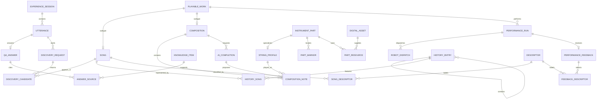

# 古筝智能体验系统数据库（独立重构版）

## 1. 重构范围

本版根据原始需求重新抽象业务实体，没有复制旧版建表脚本。数据库名称为 `guzheng_experience_rebuild`，不会覆盖现有的 `instrument_explorer`。

覆盖四条业务主线：

1. 乐器探秘：部件热点、部件详情、琴弦音高与试听、历史时间轴、故事、代表曲目。
2. 我要点歌：曲库浏览、文本搜索、智能推荐、无匹配时的替代推荐、演奏反馈。
3. 语音交互：VAD/ASR 结果、古筝知识问答、歌名或歌手模糊匹配、机器人演奏。
4. 自由创作：拖拽音符、AI 智能补全、锁定曲谱、编译并发送机器人指令。

## 2. 去冗余设计

- `playable_work` 是可演奏作品父表，`song` 与 `composition` 只保存各自特有属性。演奏记录仅保存 `work_id`，不会同时出现 `song_id`、`composition_id`。
- `utterance` 同时表示文字输入和语音识别结果，问答、语音点歌、文字推荐不各建一套输入表。
- `discovery_request` 与 `discovery_candidate` 共用搜索、直接点歌、智能推荐和替代推荐的结果结构。
- `digital_asset` 统一保存图片、音频、3D 模型、曲谱及机器人指令文件地址。
- `descriptor` 统一保存风格、情绪、场景和反馈词；歌曲标签与演奏反馈只保存外键。
- `instrument_part` 统一保存普通部件与琴弦的公共字段；琴弦独有的编号和音高进入 `string_profile`。
- `history_entry` 用层级结构表达时期、历史事件和文化故事，不建立三张字段高度相似的内容表。
- AI 建议音符直接进入 `composition_note` 并标记为 `PROPOSED`，接受后只改变状态，不复制一份音符；补全批次用作品内编号标识。
- `performance_feedback` 只关联 `performance_run`，歌曲可沿 `performance_run -> playable_work -> song` 获得，不重复保存歌曲编号。

## 3. 核心关系

## 4. 关键规则

- 语音模糊匹配阈值存于 `discovery_request.min_match_score`，需求中的 30% 应写为 `0.3000`。
- 一次推荐请求中的歌曲和排序位次都唯一，防止同一结果重复出现。
- 一次演奏最多一条总体反馈，反馈感受词可多选。
- 同一创作在同一时刻不能重复弹奏同一根弦。
- 人工音符不能处于 `PROPOSED` 状态；AI 音符通过作品内的补全批次号追溯来源。
- 数据库用状态字段保留业务历史，歌曲和作品应优先归档，不建议物理删除。

## 5. 文件

- `guzheng_experience_rebuild.sql`：可重复执行的 MySQL 8.0 建库建表脚本。
- `古筝智能体验系统数据库设计说明_含字段注释.pdf`：包含关系图、27 张表的字段字典和带中文注释的建表代码。
- 本文件：设计边界、去冗余说明和核心 ER 关系。

## 6. 实际校验结果

- 已在 MySQL 8.0.46 中完整执行建库建表脚本。
- 共创建 27 张业务表、36 个外键约束、43 个检查约束，所有表均有主键。
- 已用事务跑通“语音点歌 -> 候选歌曲 -> 机器人演奏 -> 反馈”和“自由创作 -> AI 补全音符”两条核心链路；测试数据已回滚。
